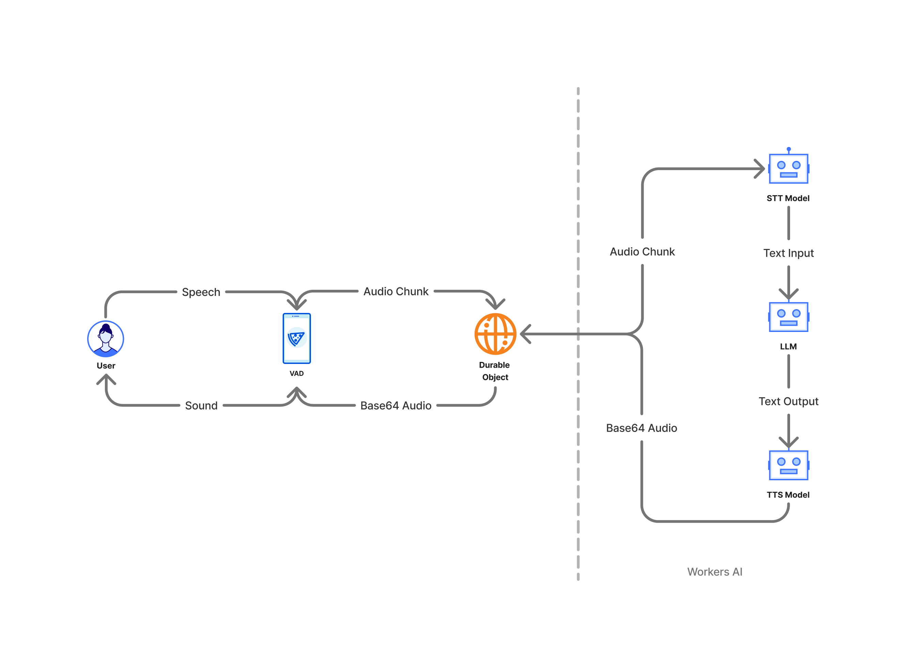

# talk2ai

This is a real-time voice-based chat application that allows users to have spoken conversations with an AI built from first principles. The application uses client-side Voice Activity Detection (VAD) to capture user speech, Cloudflare Workers for backend processing, and Cloudflare AI for Speech-to-Text (STT), Large Language Model (LLM) inference, and Text-to-Speech (TTS).

[🚀🚀🚀 Live Demo](https://talk2ai.conflare.workers.dev/)

[](https://deploy.workers.cloudflare.com/?url=https://github.com/megaconfidence/talk2ai)

## ✨ Features

- **Real-time Voice Interaction:** Speak directly to the AI and hear its responses.
- **Client-Side VAD:** Efficiently detects speech, sending audio only when the user is talking.
- **Streaming AI Responses:** AI responses are streamed back for a more interactive feel.
- **Cloudflare Powered:** Leverages Cloudflare Workers for scalable backend logic and Cloudflare AI for cutting-edge AI models.
- **Chat History:** Maintains a conversation history within a session.
- **Simple UI:** Clean interface displaying the conversation and providing controls.

## 🚀 How It Works



The application facilitates a voice conversation between a user and an AI through a series of steps orchestrated between the frontend (browser) and the backend (Cloudflare Workers).

<details>
<summary>Frontend</summary>

### Frontend (Client-Side)

1.  **User Interaction & Permissions:**
    - The user clicks the "Start Conversation" button.
    - The browser requests microphone access.
2.  **Voice Activity Detection (VAD):**
    - Once permission is granted, the client-side VAD system is initialized.
    - The VAD listens to the microphone input. When the user speaks, it captures audio.
    - It processes the speech into audio chunks (ArrayBuffers).
3.  **WebSocket Connection:**
    - A WebSocket connection is established with the backend Cloudflare Worker.
4.  **Sending Audio:**
    - The captured audio chunks are sent directly to the backend via the WebSocket.
    - Any currently playing AI audio is stopped before sending new user audio.
5.  **Receiving & Displaying Messages:**
    - The frontend listens for messages from the WebSocket:
      - **`text` type:** This is the user's speech transcribed by the backend. It's displayed in the chat UI as a user message.
      - **`audio` type:** This is the AI's response. The `text` content is displayed as an AI message, and the accompanying `audio` data is queued and played back to the user.
    - The UI updates status messages (e.g., "Listening...", "AI Speaking...", "Processing...").
    - A visualizer provides feedback when the user is speaking.
6.  **Controls:**
_ **Start/Stop Conversation:** Manages the VAD, WebSocket activity, and UI state.
_ **Clear Chat:** Clears the displayed messages and sends a `clear` command to the backend to reset the conversation history for the session.
</details>

<details>
<summary>Backend</summary>

### Backend (Cloudflare Worker with Durable Object)

The backend is built using a Cloudflare Worker that utilizes a Durable Object to manage the state for each WebSocket connection (i.e., each user session).

1.  **WebSocket Handshake:**
    - When the frontend attempts to connect to `/websocket`, the main Worker `fetch` handler upgrades the HTTP request to a WebSocket connection.
    - It gets or creates a unique Durable Object instance (using `idFromName(crypto.randomUUID())`) to handle this specific WebSocket connection.
2.  **Receiving User Audio & Commands:**
    - The Durable Object's WebSocket event listener receives messages from the client.
    - If the message is a **stringified JSON command** (e.g., `{ "type": "cmd", "data": "clear" }`), it processes the command (e.g., clears `this.msgHistory`).
    - If the message is an **audio buffer** (user's speech):
3.  **Speech-to-Text (STT):**
    - The audio buffer (an `ArrayBuffer`) is converted to a `Uint8Array`.
    - This array is sent to the Cloudflare AI STT model (`@cf/openai/whisper-tiny-en`).
    - The model transcribes the audio to text.
    - The transcribed text is sent back to the client via WebSocket (`{ type: 'text', text: user_transcription }`) so the user can see what the AI heard.
    - The user's transcribed text is added to the `msgHistory` array for context (`{ role: 'user', content: text }`).
4.  **Large Language Model (LLM) Inference:**
    - The `msgHistory` (containing the conversation so far) is sent to the Cloudflare AI LLM (`@cf/meta/llama-4-scout-17b-16e-instruct`).
    - A system prompt ("You in a voice conversation with the user") guides the LLM's behavior.
    - The LLM generates a response as a text stream. `smoothStream()` is used for potentially smoother output.
5.  **Text Buffering & Text-to-Speech (TTS):**
    - The `bufferText` utility processes the LLM's text stream, breaking it into sentences (or manageable chunks).
    - For each sentence:
      - The sentence is added to `msgHistory` (`{ role: 'assistant', content: sentence }`).
      - The sentence is sent to the Cloudflare AI TTS model (`@cf/myshell-ai/melotts`) using a `PQueue` to manage concurrency (one TTS request at a time for this session to ensure order).
      - The TTS model converts the text sentence into audio data.
6.  **Sending AI Response to Client:**
    - The generated audio data (along with the corresponding text sentence) is sent back to the client via WebSocket (`{ type: 'audio', text: sentence, audio: audio_data }`).
7.  **WebSocket Closure:** \* If the WebSocket connection closes, the Durable Object handles the closure.
</details>

### Data Flow Summary

User Speech → VAD (Client) → Audio Chunk → WebSocket → Durable Object (Backend) → STT Model → User Text Transcript (to Client & LLM) → LLM → AI Text Response Stream → Sentence Buffer → TTS Model → AI Audio Chunk → WebSocket → Client (Play Audio & Display Text)

## ⚙️ Setup & Running

```
git clone https://github.com/megaconfidence/talk2ai
cd talk2ai
npm install
npm run dev
```

## ⚠️ Known Issues & Limitations

- **LLM Context Window:** The `msgHistory` grows with the conversation. Long conversations might exceed the LLM's context window or token limits.
- **Error Handling:** While some error handling is present, more robust mechanisms could be added (e.g., WebSocket reconnection logic).

## 🤝 Contributing

Issues and PRs are welcome.
